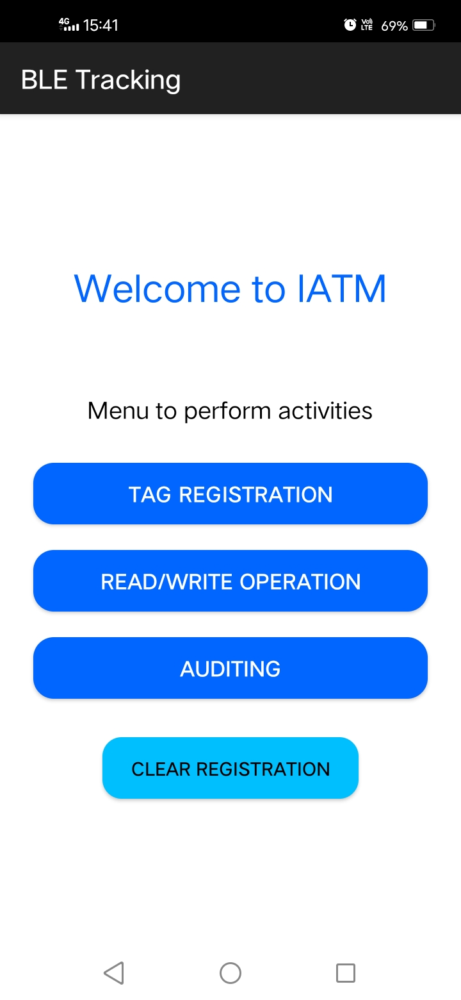
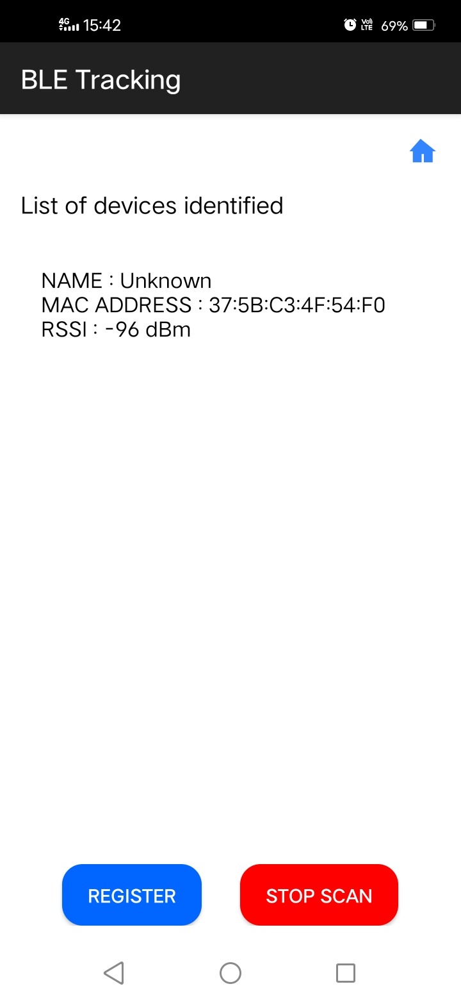
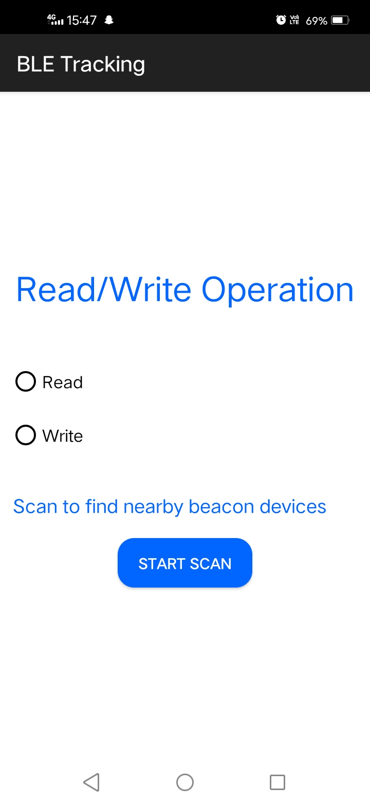

# IATM BLE Scanner App

## Overview

The IATM-BLE-Scanner-App is a mobile application that allows users to scan for and connect to Bluetooth Low Energy (BLE) devices. This app is particularly useful for interacting with IoT (Internet of Things) devices that utilize BLE technology.

## Features

- Scan for nearby BLE devices
- Connect to and interact with BLE devices
- Display device information and characteristics
- Provide options to read, write, and subscribe to BLE device services and characteristics

## Output
### Dashboard


### Scan Page


### Read Write Page


## Installation

1. Clone the repository:
   ```bash
   git clone https://github.com/N-Raghav/IATM-BLE-Scanner-App.git
3. Open the project in Android Studio
4. Build and run the app on your Android device or emulator

## Usage
- Launch the app on your Android device.
- Tap the "Scan" button to start searching for nearby BLE devices.
- Select a device from the list to connect to it.
- Once connected, you can view the device's information and characteristics.
- Interact with the device by reading and writing characteristics.

## Contributing
We welcome contributions to the IATM-BLE-Scanner-App project. If you would like to contribute, please follow these steps:

- Fork the repository.
- Create a new branch for your feature or bug fix.
- Make your changes and commit them.
- Push your branch to your forked repository.
- Submit a pull request to the main repository.
